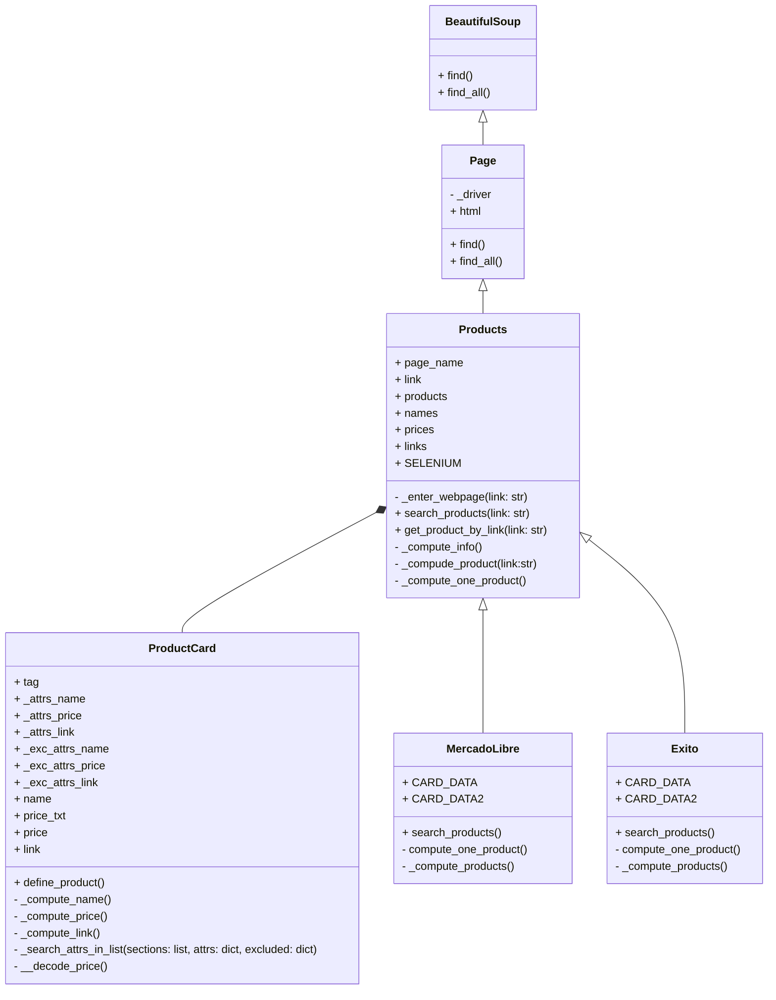

# Sistema de WebScrapping-Proyecto Programación Orientada a Objetos

## Páginas Web:
Sitios Wiki:
  * [Wikiquote](https://es.wikiquote.org/wiki/Portada)
  * [Fandom Movies](https://www.fandom.com/topics/movies)
  * [Wikipedia](https://es.wikipedia.org/wiki/Wikipedia:Portada)
    
Sitios de Retail:

## Diagramas de Clases:

## Abordaje de Solución:

## Instalación e Uso:

## Librerías usadas

- beautifulsoup4
- requests
- lxml
- pandas
- openpyxl
- matplotlib
- selenium

## Reportes
[Reporte de datos](https://unaledu-my.sharepoint.com/:f:/g/personal/diporrasc_unal_edu_co/EgGtalNhip1EqE6p7OGyqIIB4OAbREHbszYB5mtlMhiqcA?e=m3yN1G)

## Uso de selenium

Algunas páginas cargan su contenido después de acceder a ellas, haciendo que la librería requests no sea útil en estas páginas. Con selenium se evita este problema aunque toma más tiempo su ejecución.

El uso de selenium está disponible en este programa para Google Chrome. **Es necesario instalar el driver del navegador.** Puede descargarlo a través de este [link](https://googlechromelabs.github.io/chrome-for-testing/) y guardarlo en la carpeta `./drivers/`
