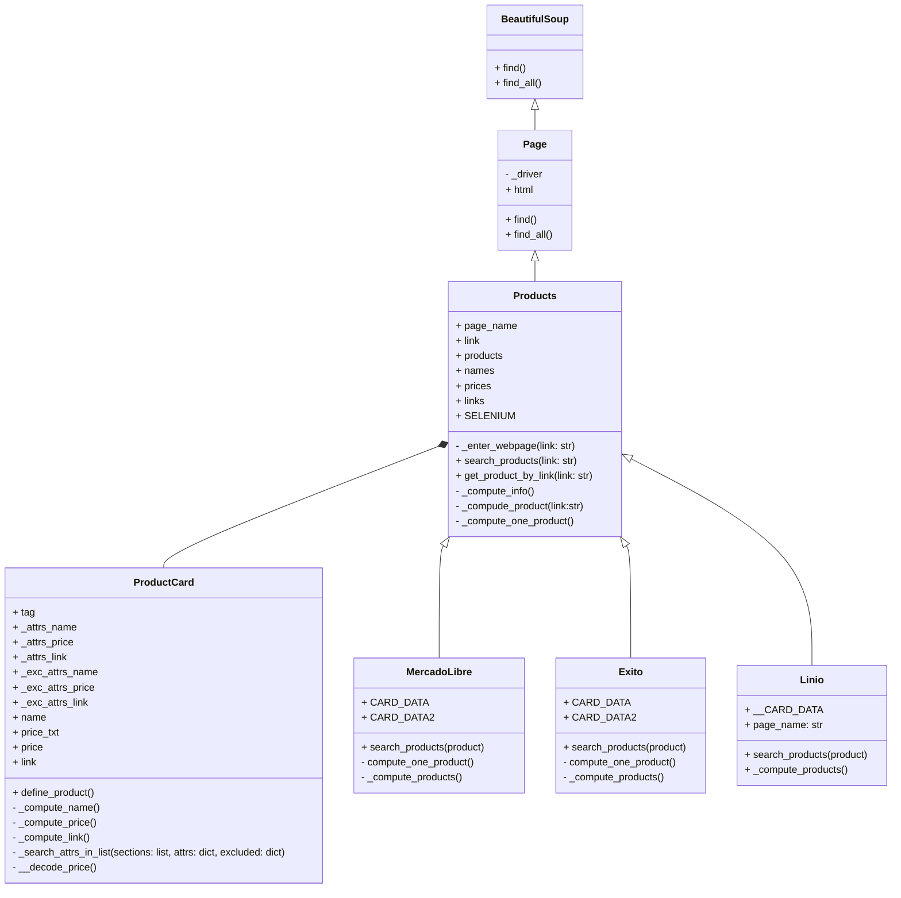
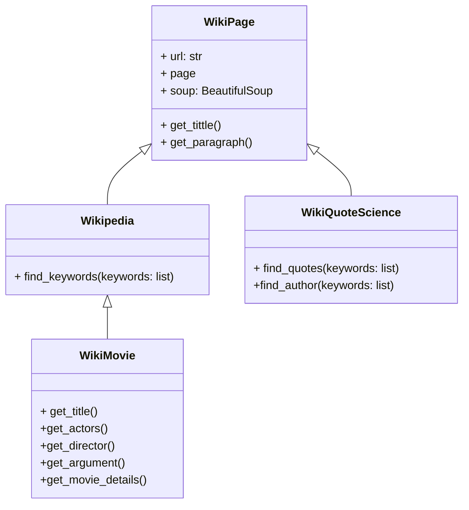
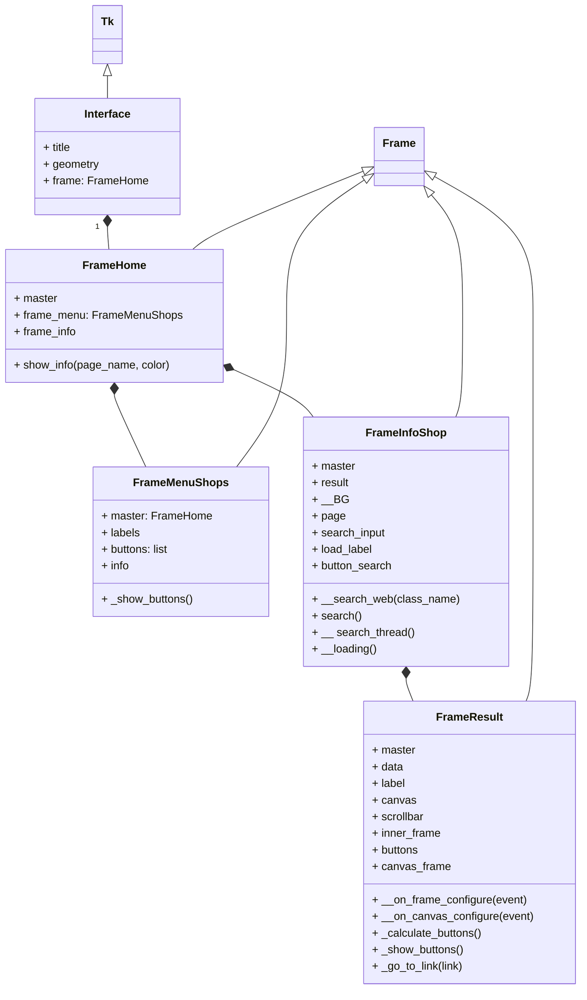

# Sistema de WebScrapping-Proyecto Programación Orientada a Objetos

## Alternativa Seleccionada:
 * **_Sistema de WebScrapping para páginas de retail y páginas tipo wiki_**

## Definición del Problema

### Páginas de Retail:
 * ### Realizar la extracción de datos asociados a productos de diferentes páginas de retail, como Mercado Libre, Linio y Éxito, con el fin de comparar precios, disponibilidad y otras características de los productos. 
 
 * El enfoque principal de la parte del programa dedicada a las páginas de retail, será a productos de tecnología y electrodomésticos. Los datos recolectados de productos como televisores, celulares, tablets, audífonos, entre otros, serán tomados durante un cierto periodo de tiempo para tener un registro histórico de las variaciones de los precios y disponibilidades, que será almacenado en una base de datos. Con el objetivo de enseñar los datos de una manera más intuitiva y un poco más práctica, inicialmente se pensó en la realización de una pequeña interfaz que sea capaz de mostrar los datos recolectados dependiendo del producto que el usuario desee buscar, y tenga la posibilidad de acceder directamente al link del producto en específico que le llame la atención. 
 * De esta manera y en sentido de orientar los datos recolectados por el sistema mencionado, paralelo y aparte a este proyecto, se puede buscar en un futuro es la creación de una interfaz mayor que sea capaz de permitir al usuario realizar la comparativa simultáneamente entre productos de diferentes páginas de retail, y así es permitirle evitar la acción de realizar la comparación del producto de interés ingresando a cada una de las páginas individualmente. 

### Páginas Wiki:
 * ### Realizar la extracción de texto de páginas como Wikipedia o Wiki Quotes, buscando automatizar la extracción de títulos, párrafos y citas. 
 
 * La extracción de texto vendría sujeta al interés del usuario del programa. En ese sentido se planteó específicamente para el caso de la extracción de Wiki Quotes, el registro de las citas asociadas a ciencia. Principalmente se busca que el programa entregue una cita con su respectivo autor asociado. Para el caso de Wikipedia, se tiene como primera alternativa la extracción de texto de un tema en concreto, y como segunda la extracción de una página asociada a una película en específico, capaz de brindar información particular de la misma, como su título, su director, su trama y sus premios. 

## Páginas Web:

### Sitios de Retail:

* [Mercado Libre](https://www.mercadolibre.com.co)
* [Linio](https://linio.falabella.com.co/linio-co)
* [Éxito](https://www.exito.com/?srsltid=AfmBOor0YAfmwqltX-hxWduWqMq0UKwCbFNT9Od6TJyyvHtGHMWu7Rpw)

###### NOTA: Sujeto a adición de más páginas

### Sitios Wiki:
  * [Wikiquote](https://es.wikiquote.org/wiki/Portada)
  * [Wikipedia](https://es.wikipedia.org/wiki/Wikipedia:Portada)
  
    


## Diagramas de Clases:

### Diagrama de Clases Scrapping a Páginas de Retail:

A continuación se presenta el diagrama de clases del programa principal encargado de realizar el scrapeo a las páginas de Retail. Se puede observar que se parte del trabajo con librerías como Selenium y BeautifulSoup que facilitan la automatización del navegador y la extracción de datos estructurados de las páginas web.



Las clases presentes en el diagrama se explican a continuación:  

* BeautifulSoup: Será la clase encargada de encapsular las funcionalidades de la librería BeautifulSoup, permitiendo el uso de métodos como find() y find_all(), que facilitan la búsqueda de elementos en el HTML de las páginas web.

* Page: Será la clase que representa a una página web. Contiene un controlador de navegador _driver y el contenido HTML de la página. Esta clase también proporciona métodos para buscar elementos en la página utilizando las capacidades de la librería BeautifulSoup.

* Products: Será la clase responsable de gestionar la búsqueda y extracción de productos de las páginas de retail. Esta clase incluye atributos como page_name, link, products, names, prices, y links. Los métodos proporcionan el ingreso a una página web, permitiendo buscar productos, y obtener información específica de productos mediante enlaces.

* ProductCard: Será la clase que represente una tarjeta de producto individual, que contiene atributos como name, price, y link. Sus métodos permiten definir los productos y estimar sus atributos.

 ###### NOTA: Se decidió utilizar el término tarjeta para describir a la sección de la página web que encapsula a cada uno de los productos y los enseña en la página principal tras la búsqueda. Muestra la imagen del producto, su nombre, precio, descuento, valoración, entre otras características. Para este caso solo se utilizan los datos de precio, nombre y link. 

* Mercado Libre, Exito y Linio: Serán las clases destinadas a manejar la búsqueda de productos en sus respectivas plataformas. Todas las clases tienen atributos para almacenar datos de tarjetas de productos (CARD_DATA, CARD_DATA2) y métodos para realizar búsquedas y calcular información sobre los productos.


### Diagrama de Clases Scrapping a Páginas Wiki:

A continuación se presenta el diagrama de clases del programa encargado de extraer el texto de páginas de Wiki, como Wikipedia y Wikiquote.




El diagrama incluye las siguientes clases:

* WikiPage: Esta clase representará a una página Wiki genérica. Por esto contará con atributos como url, page, y soup. Este último utiliza la librería BeautifulSoup y facilita el análisis del contenido HTML. Los métodos get_title() y get_paragraph(), permitirán extraer el título y los párrafos de la página, proporcionando una base común para las clases hijas. 

* Wikipedia: Esta será una subclase de WikiPage y añadirá funcionalidades específicas para la búsqueda de palabras clave en Wikipedia. Para esto se utilizará el método find_keywords(keywords: list), que recibirá unas palabras clave de interés y serán buscadas en la página.

* WikiQuoteScience: También será una subclase de Wikipage y se enfocará en la búsqueda de citas científicas en la página WikiQuote. Los métodos find_quotes() y y find_author() permitirán extraer citas junto a los autores de las mismas.

* WikiMovie: Esta clase será una clase hija de Wikipedia, y estará dedicada a la información sobre películas encontrada en dicha página. La idea es que permita, mediante los métodos definidos, encontrar, el título de la película, los actores, director/es y argumento de la película de interés que se busquen en la página principal de Wikipedia.
   
### Diagrama de Clases Posible Interfaz:




## Abordaje de Solución:

Para el sistema dedicado a las páginas de retail se buscó plantear un programa que fuese capaz de...


### Clase WikiPage:
Para el sistema dedicado a las páginas wiki, se definieron las clases que se plantearon en el diagrama de clases, con sus respectivos métodos y atributos. En primer lugar, dentro del módulo wiki_page.py se construyó la clase WikiPage, que será la clase padre que busca abstraer a una página Wiki en general. La clase recibe como atributo un link que dirige a la página wiki que se va a instanciar, y define un método que entrega el título de la página. Utilizando las librerías Requests y BeautifulSoup, se registra como txto el HTML de la página para poder parsearla (analizar una cadena de texto para identificar y extraer la información de interés). Esta clase será la encargada de heredar el atributo de URL y el método get_title a las demás clases hijas (WikiQuoteScience y Wikipedia)

``` python
"""
Módulo que contiene la clase WikiPage e importa las bibliotecas necesarias.

"""

import requests  # Importa la biblioteca requests para realizar peticiones HTTP
from bs4 import BeautifulSoup  # Importa BeautifulSoup para el análisis de HTML

# Clase Padre que representa una página tipo Wiki y define atributos y métodos comunes
class WikiPage:
    def __init__(self, url):  # Constructor que inicializa la URL y realiza la petición a la página
        self.url = url  # Asignar la URL proporcionada a la instancia
        self.page = requests.get(url)  # Hacer la solicitud HTTP para obtener el contenido de la página
        # Parsear el contenido HTML de la página utilizando BeautifulSoup
        self.soup = BeautifulSoup(self.page.text, 'html.parser') 
    
    # Método que obtiene el título de la página web    
    def get_title(self):
        return self.soup.title.text  # Retorna el texto del título de la página

```

### Clase Wikipedia:

En segundo lugar, dentro del módulo wikipedia.py se construyó la clase Wikipedia, que es una clase hija de WikiPage y hereda el atributo que define al link de la página. Como el objetivo del sistema que scrapea las páginas de Wikipedia es permitir al usuario la búsqueda de la información de interés con la ayuda del filtrado por palabras clave, se definió un método find_keywords. Este método se encargará de recibir las palabras clave que ingrese el usuario y recorrer los diferentes párrafos de la página para buscar en cada uno de ellos, los que contengan a las palabras. Una vez se encuentren las palabras en algún párrafo, se imprimirá y se seguirán buscando párrafos coincidentes hasta el final de la página. Merece la pena resaltar que los párrafos se buscaron por la etiqueta 'p', por lo que inicialmente se van a registrar todos los elementos de la página asociados a la etiqueta. En el caso de Wikipedia, la etiqueta 'p' unícamente corresponde a los párrafos. 

``` python
"""
Módulo que contiene la clase Wikipedia que hereda de WikiPage.
"""

from .wiki_page import WikiPage  # Importa la clase WikiPage del módulo wiki_page

class Wikipedia(WikiPage):
    def __init__(self, url):
        super().__init__(url)  
 
    def find_keyword(self, keywords):
        for paragraph in self.soup.select('p'):  # Selecciona todos los párrafos en la página
            # Comprobar si alguna de las palabras clave está en el texto del párrafo
            for keyword in keywords:
                if keyword.lower() in paragraph.text.lower():  # Si se encuentra palabra clave está en el párrafo se imprime el párrafo
                    print(paragraph.text)  
                    print("-------------------------------------------------") 
                    break  # Salir del bucle de palabras clave si se encontró una coincidencia
```
### Ejecución

Con el objetivo de realizar una prueba correspondiente, se decidió restringir el link de la página de Wikipedia, a la página del [Real Madrid Club de Fútbol](https://es.wikipedia.org/wiki/Real_Madrid_Club_de_Fútbol). Con la idea de probar la ejecución, se usaron la palabra clave "champions", y se ejecutó el código que se muestra a continuación. 

``` python
# WIKIPEDIA
    print("----------------------  WIKIPEDIA  ---------------------------")
    wikipedia_page = Wikipedia('https://es.wikipedia.org/wiki/Real_Madrid_Club_de_Fútbol')
    
 # Definir la lista de palabras clave a buscar
    keywords = []
    while True:
        keywords.append(input("Ingrese una palabra clave: "))
        if keywords[-1] == "salir":
            keywords.pop()
            break
    
    print(wikipedia_page.get_title())  

    # Llamar al método para encontrar párrafos que contengan las palabras clave
    wikipedia_page.find_keyword(keywords)
```

En primer lugar se define el link de la página a scrapear. Luego se le solicita al usuario las palabras clave deseadas y hasta que se ingrese una palabra que rompa la ejecución ("salir"). Posteriormente se llama el método que entrega el título de la página y al método que encuentra los párrafos que contienen a las palabras deseadas. De esta manera se obtiene una ejecución con la siguiente forma: 

```
----------------------  WIKIPEDIA  ---------------------------
Ingrese una palabra clave: champion
Ingrese una palabra clave: salir

Real Madrid Club de Fútbol - Wikipedia, la enciclopedia libre

En la temporada 2022-23, en la jornada 16, el club juega por primera vez en su historia sin ningún español de inicio.[421]​

Adicionalmente, ganó su octavo Mundial de Clubes y su vigésima Copa del Rey tras golear al Barcelona 0-4 en semifinales en el Camp Nou.

Sin embargo, perdió la Supercopa de España por 3-1 frente al F. C. Barcelona en la final, quedó eliminado de la Champions League en semifinales tras perder 4-0 contra el Manchester City de Guardiola y quedó a 10 puntos del líder Barcelona en la Liga.

Aun así, no sobra destacar que alcanzando las semifinales, el Madrid ha llegado a 11 de las últimas 13 semifinales de la Champions League.

``` 
### Clase WikiQuoteScience

En tercer lugar, en el módulo wikiquote_sience se construyó la clase WikiQuoteScience, y se buscó que con los métodos definidos, se filtraran solo las secciones relevantes dentro de la página. Esto es debido a que 

``` python
"""
Módulo que contiene la clase WikiQuoteScience que hereda de WikiPage.
"""

from .wiki_page import WikiPage  # Importa la clase WikiPage del módulo wiki_page

# Clase que hereda de WikiPage y representa una página de WikiQuote sobre ciencia.
class WikiQuoteScience(WikiPage):
    def __init__(self, url):
        super().__init__(url)  # Se heredan los atributos de la clase padre

    # Método que filtra las secciones no deseadas y encuentra la sección de citas.
    # Se usa solo dentro de la clase WikiQuoteScience.
    def _filter_relevant_sections(self):
        """
        Encuentra la sección de citas y filtra secciones no deseadas como
        'Refranes', 'Dichos populares', etc.
        """
        # Encontrar la sección principal que contiene las citas
        main_content = self.soup.find('div', {'class': 'mw-parser-output'})  # Selecciona el div principal que contiene el contenido
        sections = main_content.find_all(['h2', 'ul'])  # Encuentra todos los encabezados y listas en el contenido

        filtered_sections = []  # Lista para almacenar las secciones relevantes
        in_relevant_section = False  # Bandera para determinar si se encuentra en una sección relevante
        for section in sections:
            if section.name == 'h2':  # Verifica si el elemento es un encabezado
                # Si se encuentra el encabezado de "Citas", se activa la captura de citas
                if 'Citas' in section.text:
                    in_relevant_section = True
                # Si se encuentran encabezados de secciones no deseadas, se desactiva la captura
                elif any(x in section.text for x in ['Refranes', 'Dichos', 'Proverbios']):
                    in_relevant_section = False
            # Si se encuentra dentro de la sección relevante, se captura el contenido
            if in_relevant_section:
                filtered_sections.append(section)  # Agregar la sección relevante a la lista
        return filtered_sections  # Retornar las secciones filtradas

    def find_quotes_and_authors(self, keywords: list[str]):
        quotes = []  # Lista para almacenar las citas encontradas
        authors = []  # Lista para almacenar los autores encontrados

        # Filtrar las secciones relevantes
        relevant_sections = self._filter_relevant_sections()

        # Limitar la búsqueda de citas y autores a las secciones relevantes
        for section in relevant_sections:
            if section.name == 'ul':  # Solo buscamos dentro de listas <ul> de citas
                for quote_item in section.find_all('li'):  # Buscar cada elemento de la lista
                    # Buscar citas basadas en las palabras clave
                    for keyword in keywords:
                        if keyword in quote_item.text:  # Verifica si la palabra clave está en el texto de la cita
                            # Resaltar la palabra clave en la cita
                            highlighted_quote = quote_item.text.replace(keyword, f"\033[1;31;40m{keyword}\033[m")
                            quotes.append(highlighted_quote)  # Agregar la cita resaltada a la lista

                            # Intentar obtener el autor directamente después de la cita
                            author_tag = quote_item.find('a', title=True)  # Busca el enlace del autor
                            # Verifica que el enlace del autor no sea uno de los enlaces no deseados
                            if author_tag and not any(kw in author_tag['href'].lower() for kw in ['ayuda', 'login', 'registro', 'signup', 'admin']):
                                authors.append(author_tag.text)  # Agregar el nombre del autor a la lista
                            else:
                                authors.append("Anónimo")  # Si no hay autor, agregar "Anónimo"
                            break  # Salir del bucle de palabras clave una vez que se encuentra una coincidencia
        
        return quotes, authors  # Retornar las listas de citas y autores
```
### Ejecución

### Clase WikiMovie

### Ejecución


## Instalación e Uso:

## Librerías usadas

- beautifulsoup4
- requests
- lxml
- pandas
- openpyxl
- matplotlib
- selenium
- PySide6

## Reportes
[Reporte de datos](https://unaledu-my.sharepoint.com/:f:/g/personal/diporrasc_unal_edu_co/EgGtalNhip1EqE6p7OGyqIIB4OAbREHbszYB5mtlMhiqcA?e=m3yN1G)


## Uso de selenium

Algunas páginas cargan su contenido después de acceder a ellas, haciendo que la librería requests no sea útil en estas páginas. Con selenium se evita este problema aunque toma más tiempo su ejecución.

El uso de selenium está disponible en este programa para Google Chrome. **Es necesario instalar el driver del navegador.** Puede descargarlo a través de este [link](https://googlechromelabs.github.io/chrome-for-testing/) y guardarlo en la carpeta `./drivers/`
