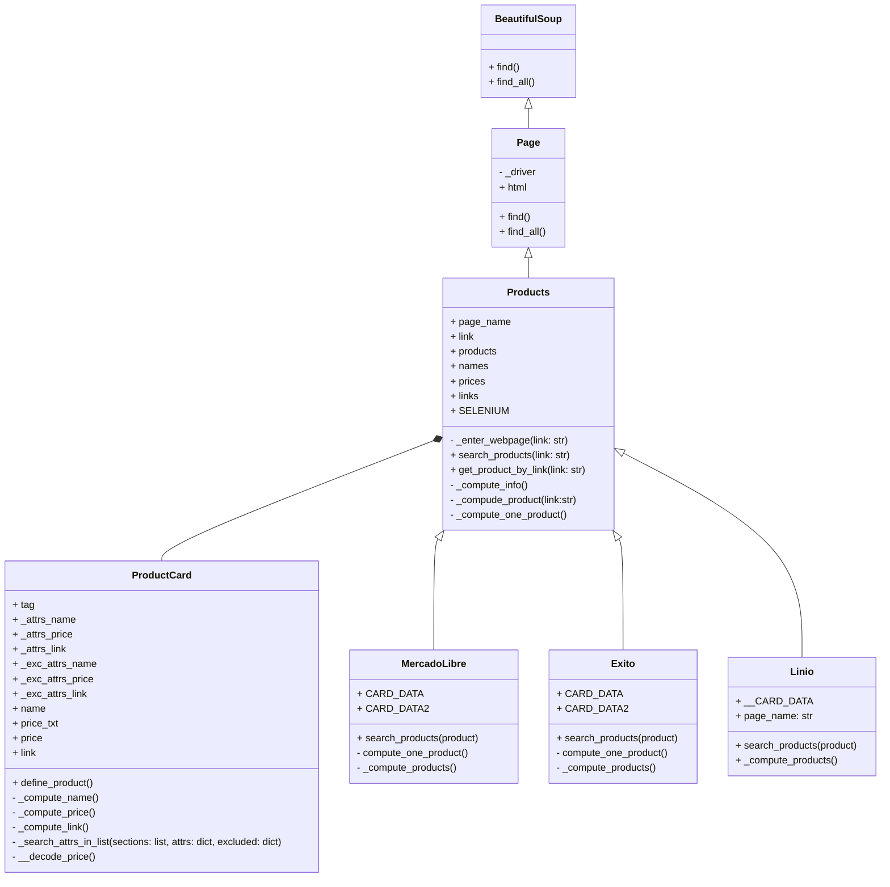
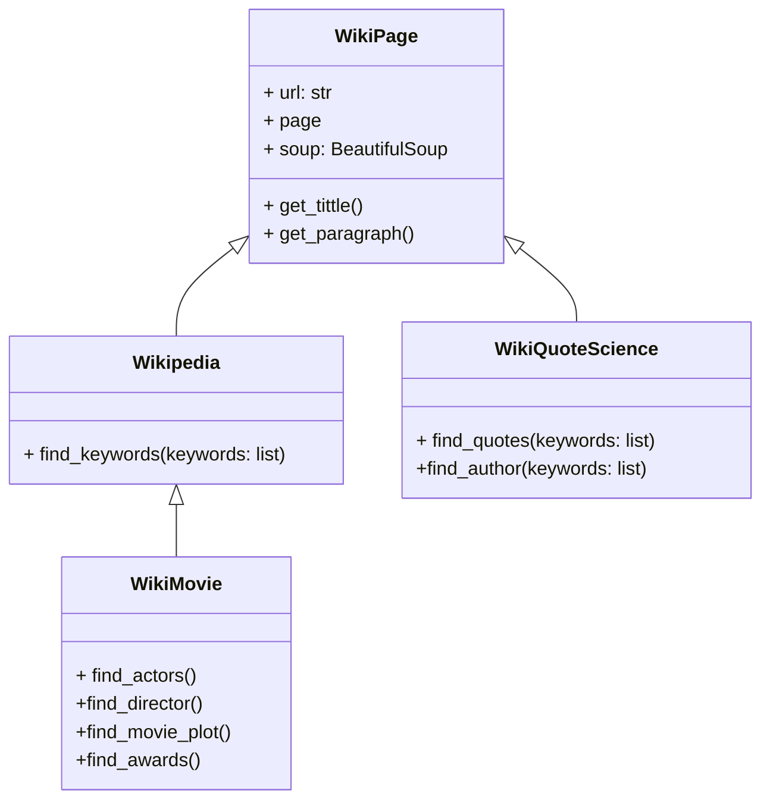
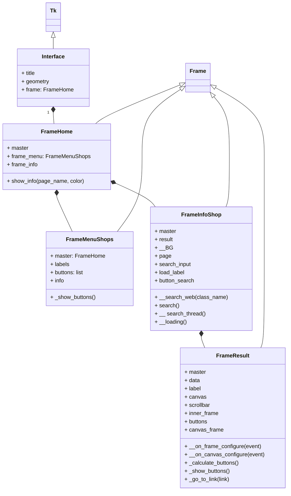

# Sistema de WebScrapping-Proyecto Programación Orientada a Objetos

## Alternativa Seleccionada:
 * **_Sistema de WebScrapping para páginas de retail y páginas tipo wiki_**

## Definición del Problema

### Páginas de Retail:
 * ### Realizar la extracción de datos asociados a productos de diferentes páginas de retail, como Mercado Libre, Linio y Éxito, con el fin de comparar precios, disponibilidad y otras características de los productos. 
 
 * El enfoque principal de la parte del programa dedicada a las páginas de retail, será a productos de tecnología y electrodomésticos. Los datos recolectados de productos como televisores, celulares, tablets, audífonos, entre otros, serán tomados durante un cierto periodo de tiempo para tener un registro histórico de las variaciones de los precios y disponibilidades, que será almacenado en una base de datos. Con el objetivo de enseñar los datos de una manera más intuitiva y un poco más práctica, inicialmente se pensó en la realización de una pequeña interfaz que sea capaz de mostrar los datos recolectados dependiendo del producto que el usuario desee buscar, y tenga la posibilidad de acceder directamente al link del producto en específico que le llame la atención. 
 * De esta manera y en sentido de orientar los datos recolectados por el sistema mencionado, paralelo y aparte a este proyecto, se puede buscar en un futuro es la creación de una interfaz mayor que sea capaz de permitir al usuario realizar la comparativa simultáneamente entre productos de diferentes páginas de retail, y así es permitirle evitar la acción de realizar la comparación del producto de interés ingresando a cada una de las páginas individualmente. 

### Páginas Wiki:
 * ### Realizar la extracción de texto de páginas como Wikipedia o Wiki Quotes, buscando automatizar la extracción de títulos, párrafos y citas. 
 
 * La extracción de texto vendría sujeta al interés del usuario del programa. En ese sentido se planteó específicamente para el caso de la extracción de Wiki Quotes, el registro de las citas asociadas a ciencia. Principalmente se busca que el programa entregue una cita con su respectivo autor asociado. Para el caso de Wikipedia, se tiene como primera alternativa la extracción de texto de un tema en concreto, y como segunda la extracción de una página asociada a una película en específico, capaz de brindar información particular de la misma, como su título, su director, su trama y sus premios. 

## Páginas Web:

### Sitios de Retail:

* [Mercado Libre](https://www.mercadolibre.com.co)
* [Linio](https://linio.falabella.com.co/linio-co)
* [Éxito](https://www.exito.com/?srsltid=AfmBOor0YAfmwqltX-hxWduWqMq0UKwCbFNT9Od6TJyyvHtGHMWu7Rpw)

###### NOTA: Sujeto a adición de más páginas

### Sitios Wiki:
  * [Wikiquote](https://es.wikiquote.org/wiki/Portada)
  * [Wikipedia](https://es.wikipedia.org/wiki/Wikipedia:Portada)
    

## Diagramas de Clases:

### Diagrama de Clases Scrapping a Páginas de Retail:

A continuación se presenta el diagrama de clases del programa principal encargado de realizar el scrapeo a las páginas de Retail. Se puede observar que se parte del trabajo con librerías como Selenium y BeautifulSoup que facilitan la automatización del navegador y la extracción de datos estructurados de las páginas web.

Las clases presentes en el diagrama se explican a continuación:  

* BeautifulSoup: Será la clase encargada de encapsular las funcionalidades de la librería BeautifulSoup, permitiendo el uso de métodos como find() y find_all(), que facilitan la búsqueda de elementos en el HTML de las páginas web.

* Page: Será la clase que representa a una página web. Contiene un controlador de navegador _driver y el contenido HTML de la página. Esta clase también proporciona métodos para buscar elementos en la página utilizando las capacidades de la librería BeautifulSoup.

* Products: Será la clase responsable de gestionar la búsqueda y extracción de productos de las páginas de retail. Esta clase incluye atributos como page_name, link, products, names, prices, y links. Los métodos proporcionan el ingreso a una página web, permitiendo buscar productos, y obtener información específica de productos mediante enlaces.

* ProductCard: Será la clase que represente una tarjeta de producto individual, que contiene atributos como name, price, y link. Sus métodos permiten definir los productos y estimar sus atributos.

 ###### NOTA: Se decidió utilizar el término tarjeta para describir a la sección de la página web que encapsula a cada uno de los productos y los enseña en la página principal tras la búsqueda. Muestra la imagen del producto, su nombre, precio, descuento, valoración, entre otras características. Para este caso solo se utilizan los datos de precio, nombre y link. 

* Mercado Libre, Exito y Linio: Serán las clases destinadas a manejar la búsqueda de productos en sus respectivas plataformas. Todas las clases tienen atributos para almacenar datos de tarjetas de productos (CARD_DATA, CARD_DATA2) y métodos para realizar búsquedas y calcular información sobre los productos.

### Diagrama de Clases Scrapping a Páginas Wiki:

A continuación se presenta el diagrama de clases del programa encargado de extraer el texto de páginas de Wiki, como Wikipedia y Wikiquote.

El diagrama incluye las siguientes clases:

* WikiPage: Esta clase representará a una página Wiki genérica. Por esto contará con atributos como url, page, y soup. Este último utiliza la librería BeautifulSoup y facilita el análisis del contenido HTML. Los métodos get_title() y get_paragraph(), permitirán extraer el título y los párrafos de la página, proporcionando una base común para las clases hijas. 

* Wikipedia: Esta será una subclase de WikiPage y añadirá funcionalidades específicas para la búsqueda de palabras clave en Wikipedia. Para esto se utilizará el método find_keywords(keywords: list), que recibirá unas palabras clave de interés y serán buscadas en la página.

* WikiQuoteScience: También será una subclase de Wikipage y se enfocará en la búsqueda de citas científicas en la página WikiQuote. Los métodos find_quotes() y y find_author() permitirán extraer citas junto a los autores de las mismas.

* WikiMovie: Esta clase será una clase hija de Wikipedia, y estará dedicada a la información sobre películas encontrada en dicha página. La idea es que permita, mediante los métodos definidos, encontrar los actores, directores, tramas y premios de las películas de interés que se busquen en la página principal de Wikipedia.
   
### Diagrama de Clases Posible Interfaz:

## Abordaje de Solución:

## Instalación e Uso:

## Librerías usadas

- beautifulsoup4
- requests
- lxml
- pandas
- openpyxl
- matplotlib
- selenium

## Reportes
[Reporte de datos](https://unaledu-my.sharepoint.com/:f:/g/personal/diporrasc_unal_edu_co/EgGtalNhip1EqE6p7OGyqIIB4OAbREHbszYB5mtlMhiqcA?e=m3yN1G)

## Uso de selenium

Algunas páginas cargan su contenido después de acceder a ellas, haciendo que la librería requests no sea útil en estas páginas. Con selenium se evita este problema aunque toma más tiempo su ejecución.

El uso de selenium está disponible en este programa para Google Chrome. **Es necesario instalar el driver del navegador.** Puede descargarlo a través de este [link](https://googlechromelabs.github.io/chrome-for-testing/) y guardarlo en la carpeta `./drivers/`
