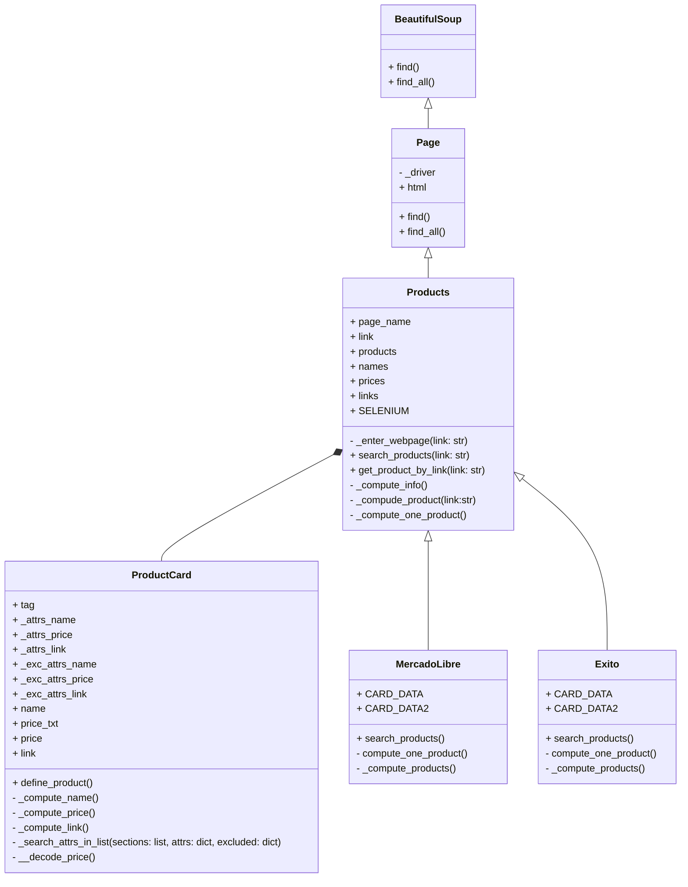
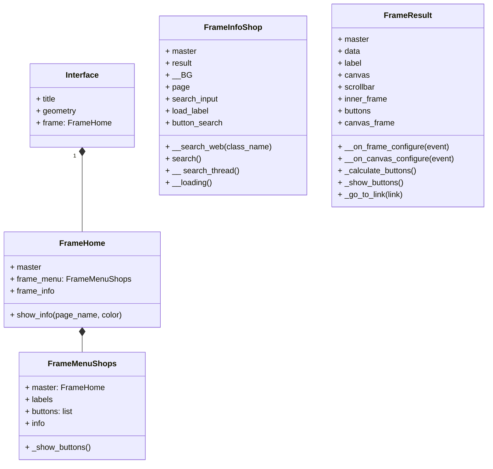

# Sistema de WebScrapping-Proyecto Programación Orientada a Objetos

## Definición del Problema

Páginas de Retail:
 * ### Brindar una interfaz que permita al usuario realizar la comparativa entre productos de diferentes páginas de retail, donde pueda observar su precio, y basado en ello tomar una decisión sobre una compra.
   En ese sentido, el objetivo es realizar la extracción de datos como nombre, precio y link, de ciertos productos (principalmente tecnología y electrodomésticos) de páginas como Amazon, MercadoLibre, Exito, Jumbo y Linio. Los datos obtenidos, se deben enseñar en una interfaz que permita 
 al usuario la identificación de los diferentes productos ofertados por lás 5 páginas, y sus respectivos precios. El obtejivo de brindar esta información al usuario, es permitirle evitar la acción de realizar la comparación del producto de interés ingresando a cada una de las páginas individualmente. La idea es permitirle realizar una comparación en vivo sobre las 5 ofertas y que basado en ello, tome una decisión sobre a cuál link dirigirse para realizar la compra.

Páginas Wiki:
 * ### Brindar al usuario una recomendación sobre qué película del momento ver, basada en las críticas brindadas por páginas como Rotten Tomatoes, Tomatazos o IMDb. 
 El obtejivo es realizar la extracción de los datos como nombre y calificación de las películas para cada una de las páginas, y brindar así una interfaz que enseñe al usuario estos datos de manera simultánea. 

## Páginas Web:
Sitios Wiki:
  * [Wikiquote](https://es.wikiquote.org/wiki/Portada)
  * [Fandom Movies](https://www.fandom.com/topics/movies)
  * [Wikipedia](https://es.wikipedia.org/wiki/Wikipedia:Portada)
    
Sitios de Retail:

## Diagramas de Clases:

Diagrama de clase interfaz: Cambiar nombre en código de Interfaz a Interface

## Abordaje de Solución:

## Instalación e Uso:

## Librerías usadas

- beautifulsoup4
- requests
- lxml
- pandas
- openpyxl
- matplotlib
- selenium

## Reportes
[Reporte de datos](https://unaledu-my.sharepoint.com/:f:/g/personal/diporrasc_unal_edu_co/EgGtalNhip1EqE6p7OGyqIIB4OAbREHbszYB5mtlMhiqcA?e=m3yN1G)

## Uso de selenium

Algunas páginas cargan su contenido después de acceder a ellas, haciendo que la librería requests no sea útil en estas páginas. Con selenium se evita este problema aunque toma más tiempo su ejecución.

El uso de selenium está disponible en este programa para Google Chrome. **Es necesario instalar el driver del navegador.** Puede descargarlo a través de este [link](https://googlechromelabs.github.io/chrome-for-testing/) y guardarlo en la carpeta `./drivers/`
