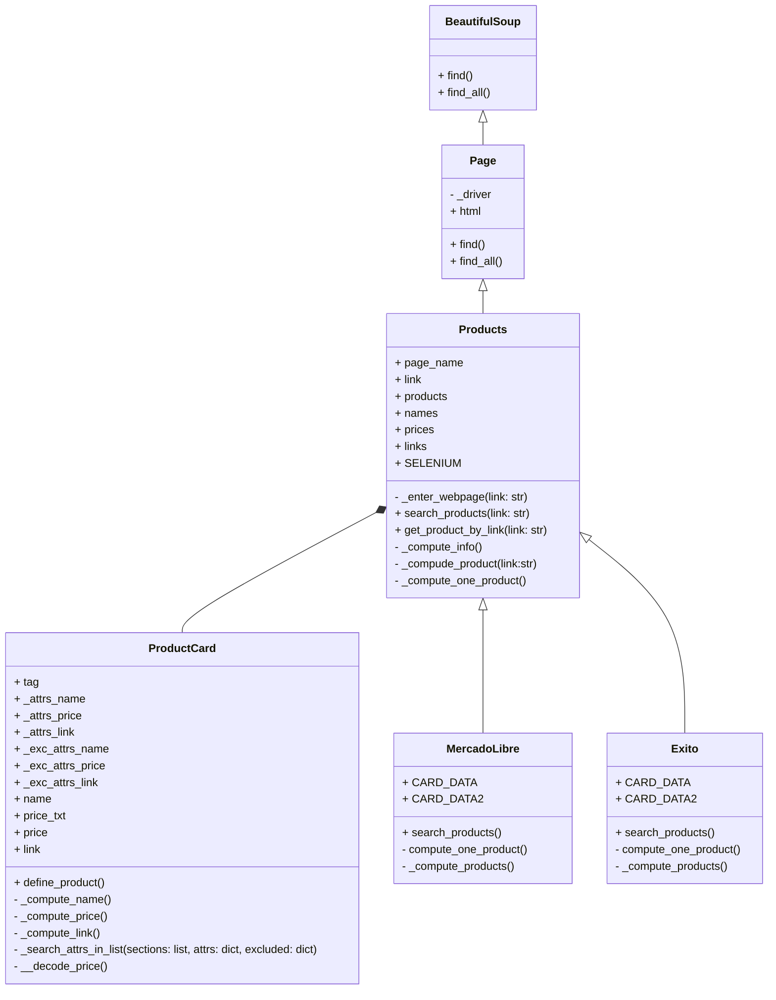
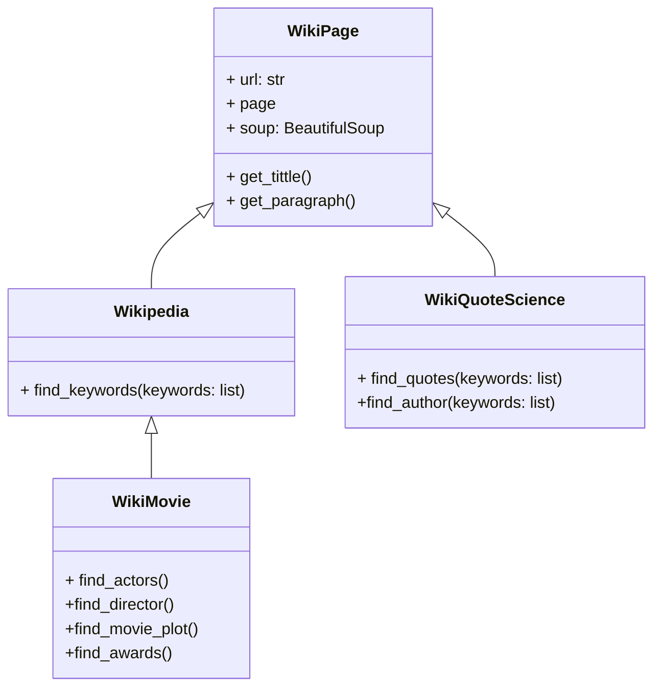
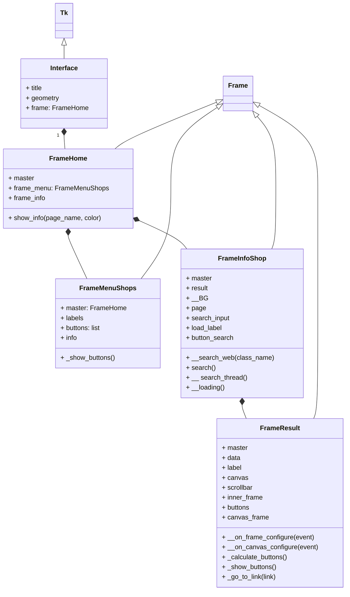

# Sistema de WebScrapping-Proyecto Programación Orientada a Objetos

## Alternativa Seleccionada:
* Sistema de WebScrapping para páginas de retail y páginas tipo wiki

## Definición del Problema

### Páginas de Retail:
 * ### Realizar la extracción de datos asociados a productos de diferentes páginas de retail, como Mercado Libre, Linio y Éxito, con el fin de comparar precios, disponibilidad y otras características de los productos. 
 
 * El enfoque principal de la parte del programa dedicada a las páginas de retail, será a productos de tecnología y electrodomésticos. Los datos recolectados de productos como televisores, celulares, tablets, audífonos, entre otros, serán tomados durante un cierto periodo de tiempo para tener un registro histórico de las variaciones de los precios y disponibilidades, que será almacenado en una base de datos. Con el objetivo de enseñar los datos de una manera más intuitiva y un poco más práctica, inicialmente se pensó en la realización de una pequeña interfaz que sea capaz de mostrar los datos recolectados dependiendo del producto que el usuario desee buscar, y tenga la posibilidad de acceder directamente al link del producto en específico que le llame la atención. 
 * De esta manera y en sentido de orientar los datos recolectados por el sistema mencionado, paralelo y aparte a este proyecto, se puede buscar en un futuro es la creación de una interfaz mayor que sea capaz de permitir al usuario realizar la comparativa simultáneamente entre productos de diferentes páginas de retail, y así es permitirle evitar la acción de realizar la comparación del producto de interés ingresando a cada una de las páginas individualmente. 

### Páginas Wiki:
 * ### Realizar la extracción de texto de páginas como Wikipedia o Wiki Quotes, buscando automatizar la extracción de títulos, párrafos y citas. 
 
 * La extracción de texto vendría sujeta al interés del usuario del programa. En ese sentido se planteó específicamente para el caso de la extracción de Wiki Quotes, el registro de las citas asociadas a ciencia. Principalmente se busca que el programa entregue una cita con su respectivo autor asociado. Para el caso de Wikipedia, se tiene como primera alternativa la extracción de texto de un tema en concreto, y como segunda la extracción de una página asociada a una película en específico, capaz de brindar información particular de la misma, como su título, su director, su trama y sus premios. 

## Páginas Web:

### Sitios de Retail:

* [Mercado Libre](https://www.mercadolibre.com.co)
* [Linio](https://linio.falabella.com.co/linio-co)
* [Éxito](https://www.exito.com/?srsltid=AfmBOor0YAfmwqltX-hxWduWqMq0UKwCbFNT9Od6TJyyvHtGHMWu7Rpw)

###### NOTA: Sujeto a adición de más páginas

### Sitios Wiki:
  * [Wikiquote](https://es.wikiquote.org/wiki/Portada)
  * [Wikipedia](https://es.wikipedia.org/wiki/Wikipedia:Portada)
    

## Diagramas de Clases:

A continuación se presenta el diagrama de clases del programa principal encargado de realizar el scrapeo a las páginas de Retail. Se puede observar que se parte del trabajo con librerías como Selenium y BeautifulSoup que facilitan la automatización del navegador y la extracción de datos estructurados de las páginas web.

El diagrama incluye las siguientes clases: 

* BeautifulSoup: Esta clase encapsula las funcionalidades de la librería BeautifulSoup, proporcionando métodos como find() y find_all(), que permiten buscar elementos en el HTML de las páginas web.

* Page: Representa una página web, conteniendo un controlador de navegador _driver y el contenido HTML de la página. Esta clase también define métodos para buscar elementos en la página utilizando las capacidades de BeautifulSoup.

* Products: Esta clase es responsable de gestionar la búsqueda y extracción de productos de las páginas de retail. Incluye atributos como page_name, link, products, names, prices, y links. Sus métodos permiten ingresar a una página web, buscar productos, y obtener información específica de productos mediante enlaces.

* ProductCard: Representa una tarjeta de producto individual, que contiene atributos como name, price, y link. Incluye métodos para definir el producto y calcular sus atributos, además de un método para buscar atributos en listas específicas.

* MercadoLibre y Exito: Estas clases heredan de Products y están diseñadas para manejar la búsqueda de productos en sus respectivas plataformas. Ambas clases tienen atributos para almacenar datos de tarjetas de productos (CARD_DATA, CARD_DATA2) y métodos para realizar búsquedas y calcular información sobre los productos.

Diagrama de clase interfaz: Cambiar nombre en código de Interfaz a Interface

Diagrama de clase interfaz: Cambiar nombre en código de Interfaz a Interface

Diagrama de clase interfaz: Cambiar nombre en código de Interfaz a Interface

## Descripción 

Descripción del Proyecto de Programación Orientada a Objetos (POO)
El proyecto implementa una solución de scraping web para extraer información sobre productos desde varias tiendas en línea. El código está diseñado para buscar productos específicos, obtener sus precios, nombres y enlaces, y luego generar informes en formato CSV con los datos recolectados. Este enfoque permite la comparación de precios y el seguimiento de productos en diferentes sitios de comercio electrónico. A continuación, se presenta una descripción detallada de las funcionalidades principales del proyecto:

Estructura del Proyecto
Clase Page: Esta clase extiende la funcionalidad de BeautifulSoup, un parser de HTML muy utilizado. Permite obtener el contenido HTML de una página web, ya sea mediante peticiones HTTP estándar o usando Selenium para cargar dinámicamente el contenido. Esto es útil cuando los datos en la página web están cargados con JavaScript y no son accesibles directamente a través de una solicitud HTTP.

Clase ProductCard: Representa un producto individual extraído de la página web. Esta clase facilita el acceso a atributos específicos de un producto, como su nombre, precio y enlace. Implementa métodos para buscar y extraer estos datos utilizando estructuras de HTML, con la posibilidad de manejar exclusiones para evitar errores.

Clase Products: Extiende la funcionalidad de la clase Page para gestionar la extracción de múltiples productos en una página. Implementa métodos para buscar productos en una URL específica y generar informes en formato CSV. Esta clase también ofrece la funcionalidad de calcular el precio promedio de los productos y convertir los datos en un DataFrame para su análisis.

Clases MercadoLibre, Exito, Linio: Estas son subclases de Products específicas para cada una de las tiendas en línea mencionadas. Cada una de estas clases está adaptada para manejar la estructura HTML particular de la tienda correspondiente, utilizando diferentes métodos y atributos para asegurar la extracción correcta de los datos de los productos.

Manejo de Excepciones: El proyecto incluye una excepción personalizada ValueNotFoundByAttr, que se lanza cuando no se puede encontrar un valor especificado por ciertos atributos en el HTML. Esto asegura que el código pueda manejar errores comunes en la extracción de datos sin interrumpir la ejecución del programa.

Flujo de Trabajo
El usuario puede especificar una tienda y un producto, y la clase correspondiente se encarga de navegar por el sitio, buscar el producto y extraer los datos relevantes.
Los datos se almacenan en listas y matrices, que luego se exportan a archivos CSV. Esto facilita el análisis de los precios de los productos a lo largo del tiempo.
La clase Products permite al usuario comparar los precios y realizar análisis de tendencias, mientras que las subclases específicas de tienda manejan las particularidades de cada sitio de comercio electrónico.

## Abordaje de Solución:

## Instalación e Uso:

## Librerías usadas

- beautifulsoup4
- requests
- lxml
- pandas
- openpyxl
- matplotlib
- selenium

## Reportes
[Reporte de datos](https://unaledu-my.sharepoint.com/:f:/g/personal/diporrasc_unal_edu_co/EgGtalNhip1EqE6p7OGyqIIB4OAbREHbszYB5mtlMhiqcA?e=m3yN1G)

## Uso de selenium

Algunas páginas cargan su contenido después de acceder a ellas, haciendo que la librería requests no sea útil en estas páginas. Con selenium se evita este problema aunque toma más tiempo su ejecución.

El uso de selenium está disponible en este programa para Google Chrome. **Es necesario instalar el driver del navegador.** Puede descargarlo a través de este [link](https://googlechromelabs.github.io/chrome-for-testing/) y guardarlo en la carpeta `./drivers/`
